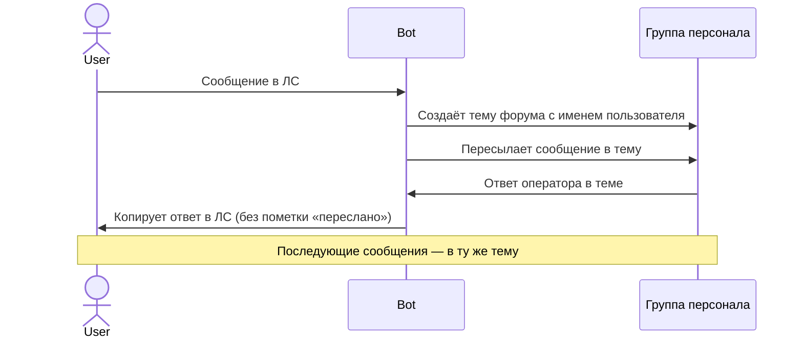

<p align="center">
  
</p>

<h1 align="center">Telegram Support Bot</h1>

<p align="center">
  Минималистичный Telegram-бот поддержки, превращающий группу-форум в хелпдеск.<br>
  Пользователь пишет в ЛС → бот создаёт тему в форуме → оператор отвечает в теме → ответ уходит пользователю.
</p>

<p align="center">
  
  
  
  
  
</p>

<p align="center">
  <a href="#возможности">Возможности</a> •
  <a href="#как-это-работает">Как это работает</a> •
  <a href="#установка">Установка</a> •
  <a href="#команды">Команды</a> •
  <a href="#архитектура">Архитектура</a> •
  <a href="#лицензия">Лицензия</a>
</p>

---

## Возможности

### 🛡️ Защита от спама
Автоматическое ограничение: не более 10 сообщений за 20 секунд. При превышении — пользователь заглушается (mute) на 60 секунд с уведомлением.

### 🧹 Авто-очистка неактивных чатов
Если в тикете нет активности 7 дней, оператор получает предупреждение с кнопкой «Очистить чат». После подтверждения тема закрывается, пользователь получает уведомление о конфиденциальности.

### 🔒 Privacy cleanup
При пересоздании темы (например, если старая удалена) пользователь получает прозрачное уведомление: «Предыдущий чат очищен по соображениям безопасности и конфиденциальности».

### 🆔 Команда /myid
Пользователь может запросить свой Telegram ID командой `/myid` в личном чате с ботом.

### 🔘 Кнопка «Завершить чат»
Пользователь может самостоятельно закрыть обращение кнопкой в приветственном сообщении. Оператор получит уведомление в теме форума.

### 📎 Все типы сообщений
Бот поддерживает пересылку текста, фото, видео, файлов, аудио, голосовых сообщений, стикеров, анимаций и видеосообщений.

### 👮 Команды оператора
- `/close` — закрыть тикет, пользователь получит уведомление
- `/reopen` — открыть закрытый тикет
- `/ban` — заблокировать пользователя и закрыть тикет
- `/unban` — разблокировать пользователя

### ⚡ Технические особенности
- **Одна зависимость** — [grammY](https://grammy.dev)
- **Режим polling** — не нужен вебхук или HTTP-сервер
- **Хранение в JSON-файле** — не требуется база данных
- **Автоматическое переоткрытие** закрытых тем при новых сообщениях от пользователя

## Как это работает



## Установка

### 1. Создайте бота

Создайте бота через [@BotFather](https://t.me/BotFather) и сохраните токен.

### 2. Создайте группу-форум

1. Создайте группу в Telegram
2. Преобразуйте её в супергруппу (Настройки → История чата → Видна)
3. Включите темы (Настройки → Темы)
4. Добавьте бота в группу и сделайте его администратором с правами:
   - Управление темами
   - Отправка сообщений
   - Удаление сообщений

### 3. Получите ID группы

Добавьте [@getmyid_bot](https://t.me/getmyid_bot) в группу или перешлите сообщение из группы — он покажет ID чата (отрицательное число, например `-100123456789`).

### 4. Клонируйте репозиторий на сервер

Зайдите на VPS по SSH:

```bash
git clone https://github.com/imcrazymonk-pixel/TG-Support-Bot.git /opt/support-bot
cd /opt/support-bot
```

### 5. Настройте окружение

```bash
cp .env.example .env
nano .env
```

Вставьте свои данные:

```env
SUPPORT_BOT_TOKEN=123456:ABC-DEF...         # обязательно — токен от @BotFather
SUPPORT_STAFF_GROUP_ID=-100123456789         # обязательно — ID супергруппы (с минусом)
SUPPORT_STORE_PATH=/app/data/topics.json     # опционально, по умолчанию
```

### 6. Запустите

```bash
sudo docker compose up -d

# Просмотр логов (убедиться, что бот подключился)
sudo docker compose logs -f
```

Контейнер установит зависимости, соберёт TypeScript и запустит бота.

Данные (привязки пользователей к топикам) сохраняются в `./data/topics.json` на сервере и не пропадают при перезапуске контейнера.

## Разработка

### Локальный запуск

```bash
# Установка зависимостей
npm install

# Запуск в dev-режиме (автоперезагрузка при изменениях)
npm run dev
```

### Сборка и продакшн

```bash
# Компиляция TypeScript → JavaScript
npm run build

# Запуск скомпилированной версии
npm start
```

### Тестирование

```bash
npm test
```

Тесты используют встроенный test runner Node.js (`node --test`) — не требуется дополнительный фреймворк.

### Структура проекта

```
src/
  index.ts      — Точка входа: polling + graceful shutdown
  config.ts     — Переменные окружения с валидацией (fail-fast)
  bot.ts        — Фабрика createBot()
  handlers.ts   — Обработчики сообщений и команд
  store.ts      — Хранилище в памяти с персистентностью в JSON-файл
tests/
  critical.test.ts  — Критические тесты (Node.js test runner)
```

### Полезные команды

| Действие | Команда |
|----------|---------|
| Внёс правки локально → запуш | `git push` |
| Обновить код на сервере | `git pull` |
| Запустить бота | `sudo docker compose up -d` |
| Остановить бота | `sudo docker compose down` |
| Перезапустить после обновления | `sudo docker compose down && sudo docker compose up -d` |
| Посмотреть логи | `sudo docker compose logs -f` |

## Команды

### Команды пользователя (личный чат)

| Команда   | Описание              |
| --------- | --------------------- |
| `/start`  | Приветственное сообщение |
| `/myid`   | Показать ваш Telegram ID  |

### Команды оператора (внутри темы форума)

| Команда    | Описание                               |
| ---------- | -------------------------------------- |
| `/close`   | Закрыть тикет, уведомить пользователя   |
| `/reopen`  | Открыть закрытый тикет                  |
| `/ban`     | Заблокировать пользователя и закрыть тикет |
| `/unban`   | Разблокировать пользователя              |

## Архитектура

```
src/
  index.ts      — Точка входа: polling + graceful shutdown
  config.ts     — Переменные окружения с валидацией (fail-fast)
  bot.ts        — Фабрика createBot()
  handlers.ts   — Обработчики сообщений и команд
  store.ts      — Хранилище в памяти с персистентностью в JSON-файл
```

- **Нет базы данных** — привязки пользователь→тема хранятся в памяти и сохраняются в JSON-файл через атомарную запись (запись во временный файл, затем переименование)
- **Нет вебхука** — используется long polling, работает за NAT/файрволом без дополнительной настройки
- **Одна зависимость** — только [grammY](https://grammy.dev) для Telegram Bot API

## Тестирование

```bash
npm test
```

Тесты используют встроенный test runner Node.js — не требуется дополнительный фреймворк.

## Лицензия

[MIT](LICENSE)
